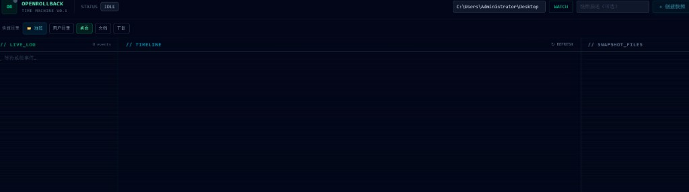
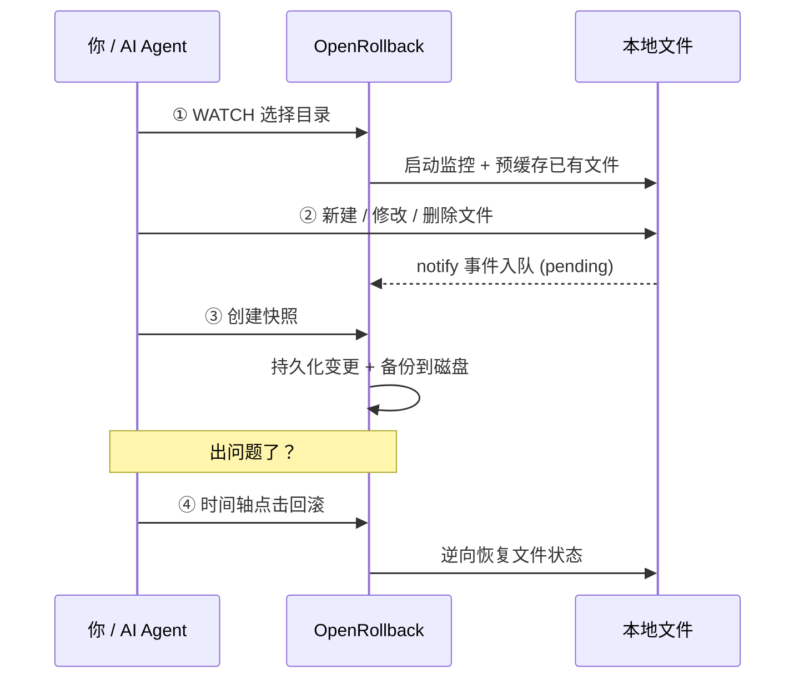
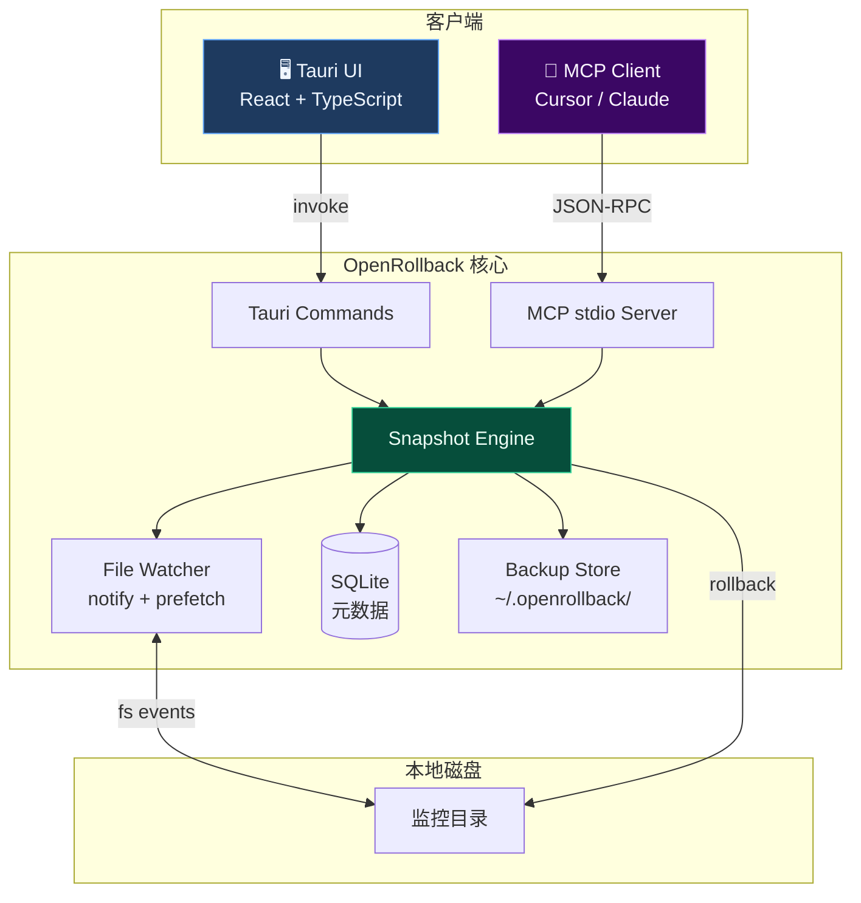

<div align="center">

# ⏪ OpenRollback

### AI Agent 的系统级安全网 · 本地文件时间机器

**监控目录变更 · 增量快照 · 时间轴一键回滚 · MCP 原生集成**

<br/>

[](https://github.com/3212085494/OpenRollback/releases)
[](https://github.com/3212085494/OpenRollback/releases)
[](https://rustup.rs/)
[](https://tauri.app/)
[](https://react.dev/)
[](https://modelcontextprotocol.io/)
[](LICENSE)

<br/>

*让 Cursor、Claude 等 AI Agent 放手改代码——出错了，一键回到过去。*

[快速开始](#-快速开始) · [使用流程](#-三步上手) · [MCP 集成](#-mcp-集成-cursor--claude) · [架构](#-架构一览) · [开发](#-开发指南)

<br/>



*时间机器 UI：快捷目录、实时日志、快照时间轴、文件详情一览*

</div>

---

## ✨ 为什么选择 OpenRollback？

AI 编程助手越来越强大，但也越来越「敢改」——批量重命名、删文件、覆盖配置，一次失误就可能毁掉数小时的工作。

**OpenRollback** 在操作系统层面盯住你指定的目录，把每一次文件变更变成可回滚的快照点。不需要 Git 仓库、不需要手动备份，打开时间轴，拖回去就好。

<table>
<tr>
<td width="50%" valign="top">

#### 😰 没有 OpenRollback

- Agent 直接改本地文件，出错难以撤销
- 不知道改了哪些路径、删了什么
- 回滚要靠 `git checkout` 或翻备份文件夹
- 与 Cursor / Claude 集成需要自建脚本

</td>
<td width="50%" valign="top">

#### 🛡️ 有了 OpenRollback

- **实时监控** — `notify` 捕获新建 / 修改 / 删除
- **增量快照** — SQLite 记录路径、动作、SHA-256 哈希
- **时间轴 UI** — 可视化浏览快照，一键回滚
- **MCP 原生** — Agent 通过 stdio 直接 `watch` / `commit` / `rollback`

</td>
</tr>
</table>

---

## 🎬 核心能力

| 能力 | 说明 |
|------|------|
| 🔭 **目录监控** | 递归监控指定文件夹，支持中文路径与空格路径 |
| 📸 **智能快照** | 将待处理变更持久化到 DB，并备份到 `~/.openrollback/backups/` |
| 🗑️ **删除可回滚** | WATCH 时预缓存已有文件，直接删除也能恢复 |
| ⏪ **精准回滚** | 恢复删除/修改的文件，撤销新建的文件 |
| 🕹️ **时间机器 UI** | 横向时间轴、快照详情面板、操作日志、确认弹窗 |
| 🤖 **MCP Server** | 5 个工具，无缝对接 Cursor / Claude Desktop |
| 🖥️ **Windows 桌面** | v0.1.0 提供 `.exe` / `.msi` 安装包（x64）；macOS / Linux 构建在 Roadmap 中 |

---

## 🚀 三步上手

> **关键概念**：快照记录的是 **WATCH 之后发生的变更**，不是对整个目录做全量拷贝。



### 桌面应用

1. 点击 **WATCH**，选择要保护的目录（建议选项目子文件夹，而非整个桌面）
2. 在目录内修改文件 — 操作日志会显示 `pending` 变更数
3. 点击 **创建快照** — 为当前变更打上存档点
4. 需要撤销时，在时间轴上选择快照 → **回滚**

### 回滚语义速查

| 快照记录的动作 | 回滚时发生什么 |
|----------------|----------------|
| `delete` 删除文件 | ✅ **恢复**被删文件（需有备份） |
| `modify` 修改文件 | ✅ **还原**为修改前内容 |
| `create` 新建文件 | 🗑️ **删除**该文件（撤销新建） |

---

## ⚡ 快速开始

### 环境要求

| 依赖 | 版本 |
|------|------|
| [Rust](https://rustup.rs/) | 1.70+ |
| [Node.js](https://nodejs.org/) | 18+ |
| Windows 额外 | [VS Build Tools](https://visualstudio.microsoft.com/visual-cpp-build-tools/) (MSVC) |

### 克隆 & 运行

```bash
git clone https://github.com/3212085494/OpenRollback.git
cd OpenRollback

npm install
npm run tauri dev      # 开发模式（热重载）
```

### 一键演示

```bash
# Windows PowerShell
.\scripts\demo.ps1

# Linux / macOS / Git Bash
bash scripts/demo.sh
```

演示脚本会：创建测试目录 → 监控 → 模拟 AI 文件操作 → 创建快照 → 回滚 → 验证文件恢复，并运行全部单元测试。

### 下载安装包

前往 [Releases](https://github.com/3212085494/OpenRollback/releases) 下载 **Windows x64** 预编译安装包，或自行打包：

```bash
npm run tauri build
# 输出: src-tauri/target/release/bundle/
```

---

## 🤖 MCP 集成 (Cursor / Claude)

将 OpenRollback 注册为 MCP Server，让 AI Agent 在改文件前后自动快照与回滚。

<details>
<summary><b>📋 点击展开 Cursor MCP 配置</b></summary>

复制 [`mcp-config.example.json`](mcp-config.example.json) 到 Cursor 设置 → MCP：

```json
{
  "mcpServers": {
    "openrollback": {
      "command": "cargo",
      "args": [
        "run",
        "--manifest-path",
        "src-tauri/Cargo.toml",
        "--bin",
        "openrollback-mcp",
        "--quiet"
      ]
    }
  }
}
```

> 生产环境建议将 `command` 改为已编译的 `openrollback-mcp` 二进制绝对路径。

</details>

### MCP 工具一览

| 工具 | 功能 |
|------|------|
| `openrollback_watch` | 开始监控目录 |
| `openrollback_stop_watch` | 停止监控 |
| `openrollback_commit` | 创建快照（提交 pending 变更） |
| `openrollback_rollback` | 回滚到指定快照 |
| `openrollback_snapshots` | 列出所有快照 |

### Agent 推荐工作流

```
watch(项目目录) → AI 执行文件操作 → commit("AI refactor batch 1") → 验证
                                                                    ↓ 出问题
                                                              rollback(snapshot_id)
```

---

## 🏗 架构一览



### 技术栈

| 层级 | 技术 |
|------|------|
| 桌面壳 | **Tauri v2** — 轻量、安全、跨平台 |
| 前端 | **React 19** + **TypeScript** + **Tailwind CSS v4** |
| 引擎 | **Rust** — `notify` · `rusqlite` · `sha2` · `chrono` |
| 协议 | **MCP** JSON-RPC over stdio |
| 存储 | `~/.openrollback/openrollback.db` + `backups/` + `staging/` |

---

## 📁 项目结构

```
openrollback/
├── src/                          # React 前端
│   ├── components/
│   │   ├── TimeMachine.tsx       #   时间轴主界面
│   │   ├── SnapshotFilePanel.tsx #   快照文件详情
│   │   ├── OperationLog.tsx      #   实时操作日志
│   │   └── ...
│   └── hooks/
│       └── useOpenRollback.ts    #   Tauri IPC 桥接
├── src-tauri/
│   ├── src/core/
│   │   ├── watcher.rs            #   文件监控 + 预缓存
│   │   ├── snapshot.rs           #   快照创建 & 回滚引擎
│   │   ├── db.rs                 #   SQLite 持久化
│   │   └── util.rs               #   路径规范化 & 哈希
│   ├── src/mcp/                  #   MCP stdio 服务
│   ├── src/commands.rs           #   Tauri invoke 命令
│   └── src/bin/
│       ├── openrollback_mcp.rs   #   MCP 独立二进制
│       ├── openrollback_demo.rs  #   端到端演示
│       └── openrollback_e2e_autotest.rs
├── scripts/
│   ├── demo.ps1                  #   Windows 演示脚本
│   ├── demo.sh                   #   Unix 演示脚本
│   └── e2e_autotest.ps1          #   全流程自动化测试
└── mcp-config.example.json
```

---

## 🧪 开发指南

### 常用命令

```bash
# 前端
npm run lint              # TypeScript 类型检查
npm run build             # 生产构建

# Rust
cargo test --manifest-path src-tauri/Cargo.toml    # 19 项单元 + 集成测试
cargo clippy --manifest-path src-tauri/Cargo.toml  # Lint

# 桌面
npm run tauri dev         # 开发模式
npm run tauri build       # 打包安装程序

# 端到端
.\scripts\e2e_autotest.ps1          # Windows 全流程 E2E
cargo run --bin openrollback-demo   # 仅演示引擎逻辑
```

### 测试覆盖

- ✅ 快照创建 & 持久化 & 备份
- ✅ 修改 / 删除 / 新建 三种回滚路径
- ✅ 中文文件名 & 空格路径
- ✅ 空目录拒绝创建快照
- ✅ 文件被占用时的友好错误提示
- ✅ 真实 `notify` 文件系统事件集成测试

---

## 💡 使用建议

> **监控整个桌面？** 可以，但不推荐。桌面文件成千上万，预缓存有上限（默认 10,000 文件），超出部分删除后可能无法回滚。请优先监控 **项目子目录**。

> **快照显示 0 个文件？** 请确认：先 WATCH → 再修改文件 → 最后创建快照。快照提交的是 **pending 队列**，不会对目录做全量扫描。

> **删除的文件回滚不了？** 若文件在 WATCH 之前就已存在且未被预缓存，删除事件将缺少备份。解决：WATCH 后重新创建文件再删除，或监控更小的目录。

---

## 🗺️ Roadmap

- [x] 本地文件系统监控 (`notify`)
- [x] 增量快照 + SQLite 元数据
- [x] 时间轴 UI + 回滚 / 删除快照
- [x] Tauri 命令桥接 + MCP stdio 服务
- [x] 删除回滚预缓存 + 中文路径支持
- [x] Windows x64 安装包（`.exe` / `.msi`）
- [ ] macOS / Linux 官方安装包
- [ ] 快照差异对比视图 (diff)
- [ ] 自动快照策略（定时 / 变更阈值）
- [ ] 网络 & 数据库操作监控
- [ ] 云同步与团队协作

---

## ⚠️ 免责声明

OpenRollback 为**本地文件辅助工具**，适用于个人开发与 AI Agent 工作流场景：

- 本软件**不能替代** Git、专业备份方案或版本控制系统。
- 快照仅记录 **WATCH 之后**的变更；监控目录过大、文件未预缓存时，部分删除可能无法回滚。
- 请在重要操作前自行做好备份；因误操作、磁盘故障、权限问题等导致的数据丢失，作者不承担赔偿责任。
- v0.1.0 为早期版本，建议在非生产关键数据上先行试用。

---

## 🤝 参与贡献

欢迎 Issue、PR 和 Star ⭐

1. Fork 本仓库
2. 创建特性分支：`git checkout -b feat/amazing-feature`
3. 提交改动并确保 `cargo test` + `npm run lint` 通过
4. 发起 Pull Request

---

## 📄 开源协议与更新日志

本项目采用 [MIT 开源许可证](LICENSE)（与麻省理工学院无关，仅为一种开源协议名称）。  
版权 © OpenRollback Contributors · [更新日志 CHANGELOG](CHANGELOG.md)

---

<div align="center">

**如果 OpenRollback 帮你从 AI 的「手滑」中救回了代码，请给我们一个 Star ⭐**

*Built with 🦀 Rust · ⚡ Tauri · ⚛️ React · 🤖 MCP*

</div>
